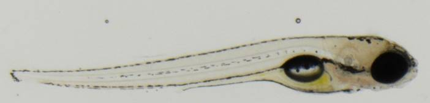
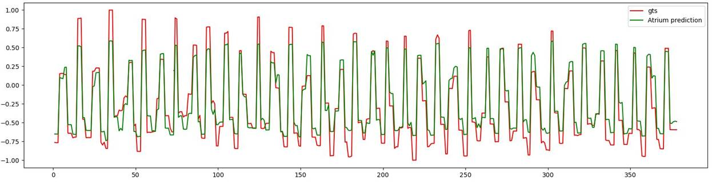

## This is a project which uses Resnets and convLSTMs to automatically regresses heart beat rate of zebrafishs from videos.
## It is a personal side project and I prohibit any and all commercial uses. Otherwise feel free to use it as backbone for your task.
## I was able to reach 95% accuracy as of 2021.

 
